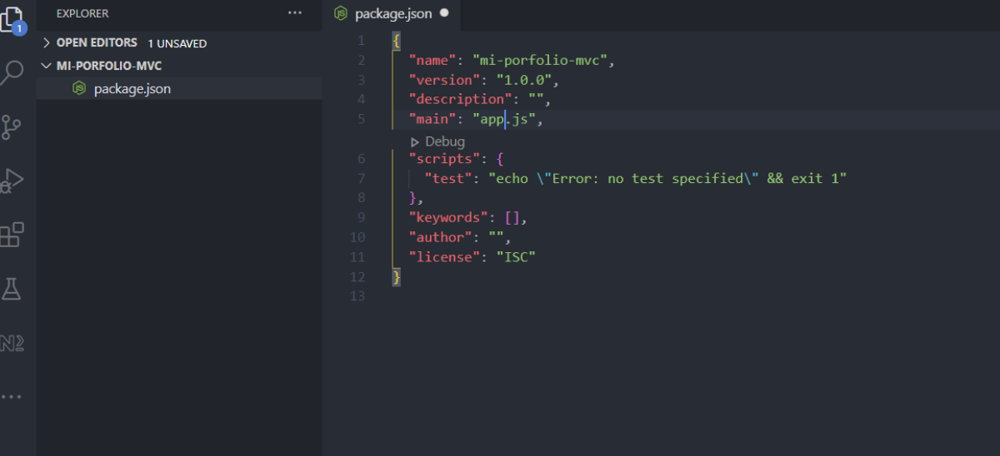
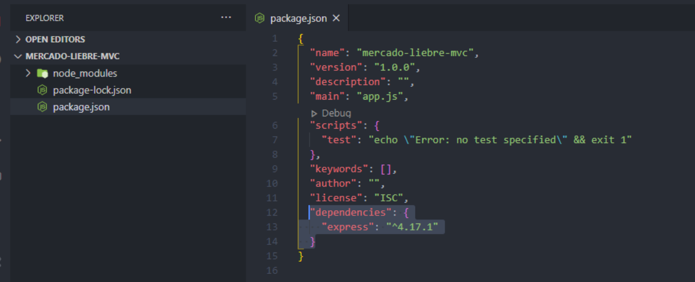
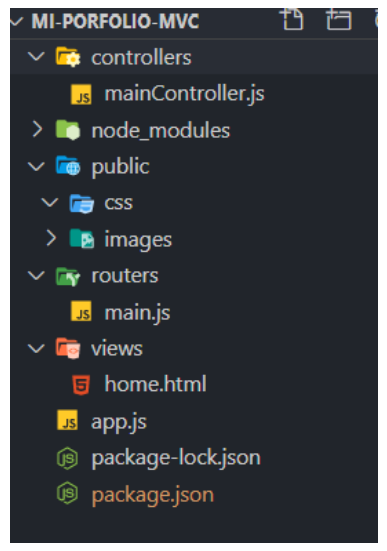

# PATRONES DE DISEÑO MVC

## **My porfolio - I love photography**

## Objetivo
Bueno, ahora tenemos que reorganizar un poco nuestro código y seguir mejorando la
arquitectura del sitio agregando patrones de diseño como el Modelo Vista Controlador,
que nos permite, entre otras cosas, estructurar un sitio más limpio.

En los siguientes desafíos iremos paso a paso construyendo un sitio basado en MVC.
¡Buena suerte!😎👍✨

## Micro desafío - Paso 1
Crearemos un nuevo proyecto basado en la arquitectura MVC, por lo que en un
directorio vacío, por ejemplo “mi-porfolio-mvc”, ejecutaremos el siguiente comando:

C:\mi-porfolio-mvc> npm init -y

Recordemos que este comando nos inicializa el archivo package.json, es decir, el archivo
de formato json donde especificamos la información de configuración de nuestro
proyecto:

Para nuestro sitio vamos a definir que el punto de entrada a la aplicación es el archivo
app.js, en vez de index.js como estaba por defecto. 😉

## Micro desafío - Paso 2
El siguiente paso es instalar Express en nuestro proyecto. Para eso, en el directorio
mi-porfolio-mvc, ejecutamos el siguiente comando:

C:\mi-porfolio-mvc> npm install express

Al correr dicho comando, se genera, por un lado, una referencia dentro de nuestro
archivo package.json para avisar que vamos a usar Express en este proyecto y, por
otro, nos crea la carpeta denominada node_modules, donde se alojarán todas las
dependencias de aplicaciones de terceros que necesitemos para correr nuestro proyecto.
Dicha carpeta no la subimos a Git*.

(*) Si estamos clonando un proyecto desde GitHub que ya fue creado con Express, lo que
debemos hacer, una vez que termine el proceso de clonación, es posicionarnos dentro
del directorio del proyecto y correr npm install. Este comando, tomando como
referencia el archivo package.json, instalará todo lo que necesitemos para poder correrlo
en nuestra máquina local, en la carpeta node-modules.

## Micro desafío - Paso 3
Dentro del IDE, creamos nuestro punto de acceso, es decir, el archivo app.js. En el mismo
indicaremos que utilizaremos Express con la siguiente línea:

const express = require('express');

Como require(express) nos retorna una función, debemos invocarla:

const app = express();

Ahora, en la constante app, vamos a tener disponible todos los métodos del framework.

## Micro desafío - Paso 4
Ahora ya estamos listos para configurar nuestro servidor.

app.listen(3000, ()=>{

console.log('Servidor funcionando');

});

## Micro desafío - Paso 5
El siguiente paso es dejar lista la estructura de nuestro sitio:

Para esto nos han dejado los siguientes archivos: images, style.css, home.html,
about.html y nosotros debemos solamente colocarlos en la carpeta correspondiente.
Una vez que tengamos lista la estructura, crearemos nuestros controladores, para esta
práctica crearemos mainController.js:

- Nuestro desafío ahora es crear la lógica necesaria para enviar la vista
home.html cuando sea requerida dentro de dicho controller.

## Micro desafío - Paso 6
Crear el sistema de ruteo para renderizar la home.html cuando tipeamos
http://localhost:3000/.

## Conclusión
El patrón de diseño MVC nos permite mantener nuestra lógica agrupada según
responsabilidades. Por ejemplo, toda la lógica que tenga que ver con la presentación va
en capa de la vista y toda la lógica referida al negocio de nuestro sitio la colocamos en la
capa de los controladores. Por último, el sistema de ruteo nos permite ofrecer una capa
que se dedica especialmente a atender nuestras peticiones.
¡Hasta la próxima!

## Ubicación -> Programación/TRABAJOS PRACTICOS/Patrones de diseño MVC