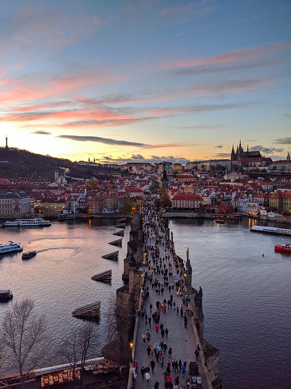

# PATRONES DE DISEÑO MVC

## **My porfolio - I love photography**

## Sobre este proyecto...
Este está basado en la arquitectura MVC -> Modelo Vista Controlador 
la cual propone que **cada uno de estos componentes resuelva y se encargue de una particularidad en específico**, sin tomar atribuciones y responsabilidades de otros componentes.
Entonces la Vista se encargará de la parte visual de la aplicación. El Modelo, de administrar la información de la base de datos. Y el Controlador, de ser un puente de comunicación entre los otros dos.

También se instalará Express para nuestro sistema de ruteo. Segmentaremos nuestras rutas y controladores para asi renderizar las vistas de acuerdo a nuestras peticiones.
😎👍✨

## M5 C19
## Ubicación -> Programación/TRABAJOS PRACTICOS/Patrones de diseño MVC